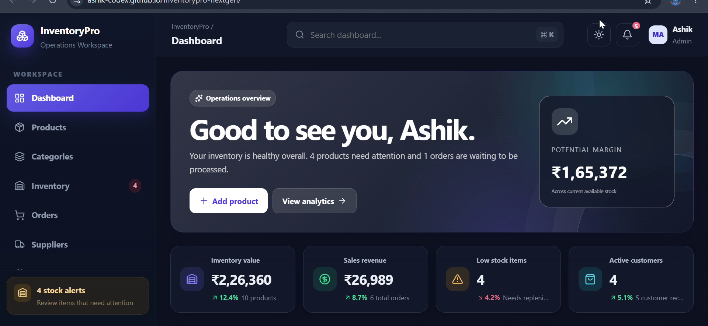
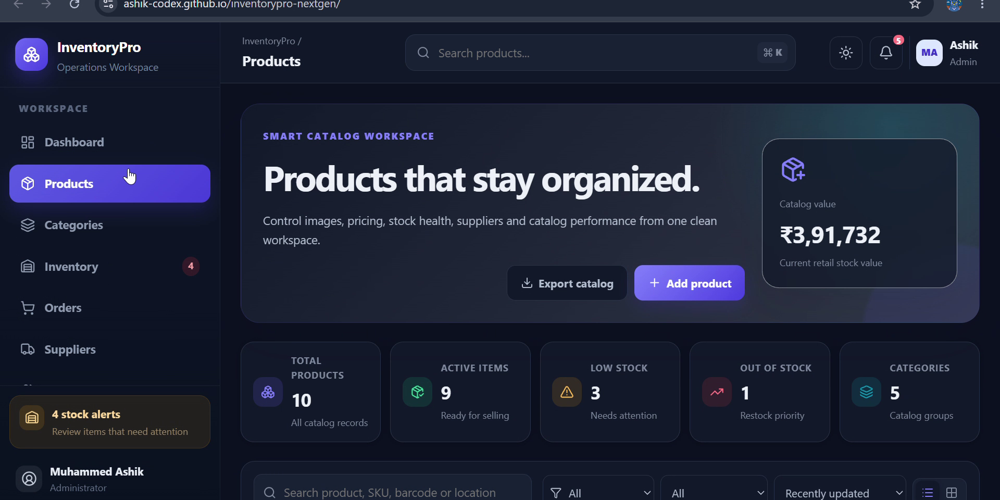
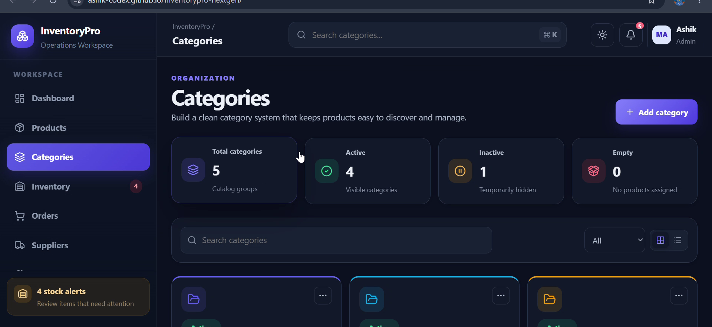
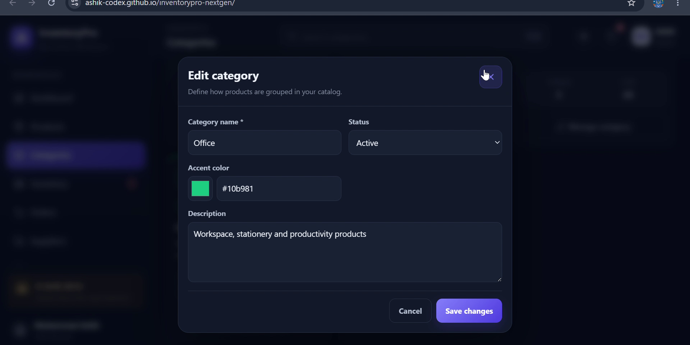
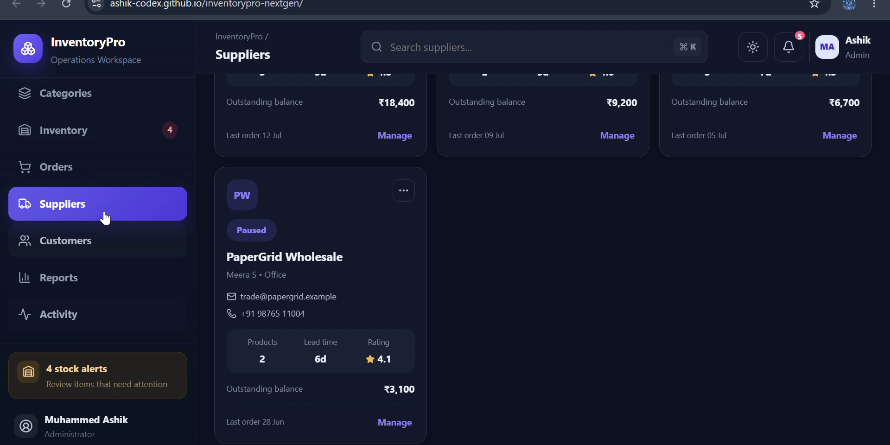
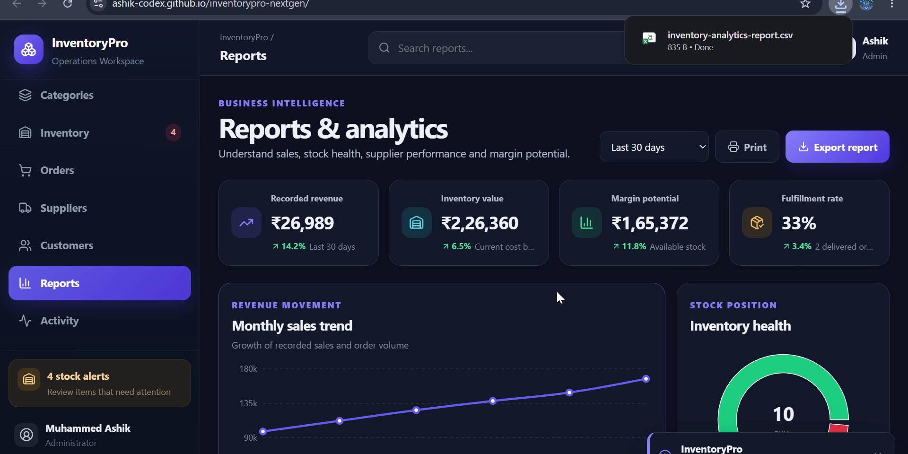

<div align="center">

# 📦 InventoryPro NextGen

### A modern and responsive frontend inventory management system built with React and Vite

[](https://react.dev/)
[](https://vite.dev/)
[](https://developer.mozilla.org/en-US/docs/Web/JavaScript)
[](https://recharts.org/)
[](https://ashik-codex.github.io/inventorypro-nextgen/)

[🌐 Live Demo](https://ashik-codex.github.io/inventorypro-nextgen/) •
[💻 GitHub Repository](https://github.com/ashik-codex/inventorypro-nextgen)

</div>

---

## 📌 Overview

**InventoryPro NextGen** is a modern frontend inventory management dashboard designed to simulate the workflow of a real business application.

The project provides dedicated modules for managing products, categories, stock movements, orders, suppliers and customers. It also includes reports, notifications, themes, workspace settings and browser-based data persistence.

The application is currently a **frontend-only portfolio project**. Its data is stored in the browser using **LocalStorage**, so it can be explored without configuring a backend server or database.

---

## ✨ Main Features

### 📊 Dashboard

- Business KPI overview
- Revenue and inventory statistics
- Sales-trend charts
- Category distribution
- Low-stock monitoring
- Recent orders
- High-value product overview
- Recent workspace activity
- Personalized dashboard greeting

### 📦 Product Management

- Add, edit and delete products
- Duplicate product records
- Product detail view
- Table and grid layouts
- Search and filtering
- Category and stock-status filters
- Sorting and pagination
- Bulk selection and deletion
- CSV export

### 🗂️ Category Management

- Add and update categories
- Delete and duplicate categories
- Active and inactive status
- Product and unit counts
- Search and filters
- Table and grid modes

### 🏭 Inventory Control

- Live stock-health overview
- Warehouse locations
- Stock-in and stock-out
- Returns and adjustments
- Stock-movement history
- Reorder suggestions
- Low-stock alerts
- CSV export

### 🛒 Order Management

- Create and manage orders
- Automatic stock allocation
- Payment-status tracking
- Order-status tracking
- Table and Kanban views
- Invoice view
- Print support
- CSV export

### 🚚 Supplier Management

- Supplier and vendor records
- Contact information
- Supplier ratings
- Lead-time tracking
- Balance information
- Product coverage
- Search, filtering and CSV export

### 👥 Customer Management

- Customer profiles
- Loyalty tiers
- Lifetime-value tracking
- Order counts
- Contact information
- Search and filtering
- CSV export

### 📈 Reports and Analytics

- Revenue overview
- Inventory value
- Profit-margin indicators
- Fulfillment rate
- Sales trends
- Stock-health analytics
- Category-value analysis
- Supplier performance
- Print layout
- CSV export

### ⚙️ Workspace Settings

- Company and profile preferences
- Currency and tax configuration
- Notification preferences
- Light and dark themes
- Compact display density
- JSON backup and restore
- Demo-data reset

---

## 📸 Screenshots

### Personalized Dashboard

The dashboard provides KPIs, business analytics and a personalized **“Good to see you, Ashik.”** greeting.



---

### Products Page

Products can be searched, filtered, managed and exported through a structured workspace.



---

### Categories Page

The category module provides category records, status controls, product counts and filtering options.



---

### Inventory Page

The inventory workspace tracks stock levels, movements, availability and reorder requirements.



---

### Customers Page

Customer records include contact information, loyalty details, order counts and lifetime value.



---

### Reports Page

The reporting workspace presents revenue, inventory, stock-health and business-performance insights.



---

## 🛠️ Tech Stack

| Technology | Purpose |
|---|---|
| React | Component-based user interface |
| Vite | Development server and production build |
| JavaScript | Application logic and interactivity |
| CSS3 | Styling, themes and responsive layouts |
| Recharts | Charts and data visualizations |
| Lucide React | Interface icons |
| LocalStorage | Browser-based data persistence |
| GitHub Pages | Static deployment and hosting |

---

## ⚙️ How the Application Works

1. The application loads demo workspace data from browser LocalStorage.
2. Users can manage products, categories, inventory, orders and business records.
3. Changes are immediately reflected across related dashboard statistics.
4. Updated workspace data is saved locally in the browser.
5. Reports and charts are generated from the current workspace data.
6. Workspace data can be exported as CSV or backed up as JSON.
7. The saved workspace is restored when the application is reopened.

> **Important:** This version does not use a backend API or cloud database. Data remains inside the browser where the project is opened.

---

## 🚀 Getting Started

### Prerequisites

Install the following before running the project:

- [Node.js](https://nodejs.org/)
- npm
- Git

### Clone the Repository

```bash
git clone https://github.com/ashik-codex/inventorypro-nextgen.git
```

### Open the Project Folder

```bash
cd inventorypro-nextgen
```

### Install Dependencies

```bash
npm install
```

### Start the Development Server

```bash
npm run dev
```

Open the local URL displayed in the terminal, usually:

```text
http://localhost:5173/
```

---

## ✅ Quality Checks

Run ESLint:

```bash
npm run lint
```

Create a production build:

```bash
npm run build
```

Preview the production build:

```bash
npm run preview
```

---

## 📂 Project Structure

```text
inventorypro-nextgen/
├── .github/
│   └── workflows/
├── public/
├── screenshots/
│   ├── 01_dashboard_good_to_see_you.png
│   ├── 02_products_page.png
│   ├── 03_categories_page.png
│   ├── 04_inventory_page.png
│   ├── 05_customers_page.png
│   └── 06_reports_page.png
├── src/
├── .gitignore
├── README.md
├── eslint.config.js
├── index.html
├── package.json
├── package-lock.json
└── vite.config.js
```

---

## 💾 Data Persistence

InventoryPro NextGen uses browser **LocalStorage**.

This means:

- Workspace changes remain after page refresh
- Data is stored only in the current browser
- Clearing browser storage removes the saved workspace
- Data is not automatically shared between devices
- No external database is currently connected
- JSON backup and restore can be used to transfer workspace data manually

---

## 🌗 User Experience

- Responsive sidebar navigation
- Mobile-friendly navigation
- Light and dark themes
- Compact display mode
- Command palette using `Ctrl + K` or `Cmd + K`
- Dynamic low-stock notifications
- Pending-order notifications
- Toast messages
- Confirmation dialogs
- Lazy-loaded pages
- Relative asset paths for static deployment

---

## ⚠️ Current Limitations

- Frontend-only architecture
- No authentication
- No role-based permissions
- No backend API
- No cloud database
- No real multi-user collaboration
- Data is limited to the current browser
- Demo business data is used for presentation

---

## 🔮 Future Improvements

- 🔐 Authentication and user accounts
- 👤 Admin and employee roles
- 🗄️ Node.js and Express backend
- 🛢️ MongoDB or PostgreSQL database
- ☁️ Cloud-based data synchronization
- 📦 Barcode and QR-code scanning
- 📧 Email and invoice notifications
- 📱 Progressive Web App support
- 🧾 Advanced invoice generation
- 🤖 AI-powered demand forecasting
- 🔔 Real-time stock alerts
- 📊 Advanced custom reports

---

## 🎯 Learning Outcomes

Building this project helped me practise:

- React components and reusable layouts
- State management
- Complex CRUD interfaces
- Search, filter, sort and pagination logic
- LocalStorage persistence
- Chart and report integration
- Responsive dashboard design
- Light and dark theme implementation
- CSV and JSON export workflows
- Git and GitHub version control
- GitHub Pages deployment

---

## 🌐 Deployment

The project is deployed using GitHub Pages.

**Live Application:**

https://ashik-codex.github.io/inventorypro-nextgen/

---

## 👨‍💻 Author

**Muhammed Ashik H**

- GitHub: [@ashik-codex](https://github.com/ashik-codex)

---

## ⭐ Support

If you found this project useful, consider giving the repository a star.

<div align="center">

**Built with React, Vite and continuous learning.**

</div>
